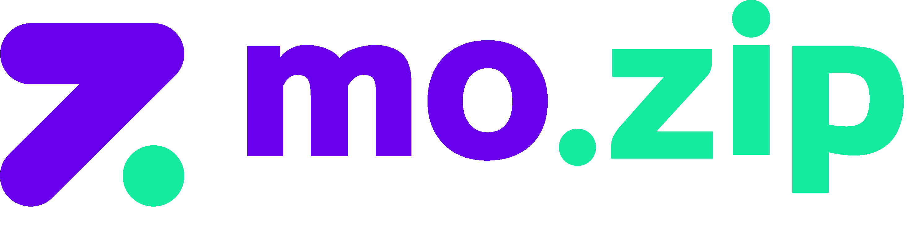

## mozip 프로젝트

## 1. 프로젝트 기획서

- **프로젝트 명** : mo.zip(모든 프로젝트의 집합소/ 개발자 모집)
- **프로젝트 기간** : 2024년 5월 2일 ~ 2024년 7월 19일
- **프로젝트 인원** : 4명
- **프로젝트 소개** : 개발자와 취준생들이 모여 프로젝트를 함께 할 수 있는 협업 플랫폼으로 다양한 프로젝트에 참여하며 실력을 키우고 경험을 쌓을 수 있습니다.
- **프로젝트 목표** : IT 및 디자인 프로젝트의 협업을 촉진하고, 전문가들과 인재들이 모여 창의적이고 효율적인 팀워크를 구현할 수 있도록 지원하는 플랫폼 제작
- **프로젝트 배포주소** : [mozip](http://52.78.114.31:8082/)

## 2. 담당기능(수정필요)

| 최재영(백엔드 리더)           | 김동건(풀스택)       | 이윤지(프론트 리더)      | 한지수(풀스택)                     |
|-----------------------|----------------|------------------|------------------------------|
| 퍼블리싱 및 프론트엔드          | 퍼블리싱 및 프론트엔드   | UI 세팅 및 퍼블리싱     | 퍼블리싱 및 프론트엔드                 |
| 백엔드 세팅                | 회원가입           | 프론트엔드 구축         | 프로젝트 상세 데이터 로드(HTML Form 통신) |
| 스프링 시큐리티 세팅           | 아이디 찾기         | 퍼블리싱 및 프론트엔드 셋팅  | 게시물 조회수 기능                   |
| 로그인 및 소셜로그인(카카오) 구현   | 마이페이지 상세       | 프로젝트 검색 기능       | 게시물 좋아요 기능                   |
| 회원탈퇴 구현               |                |                  |                              |
| 프로젝트모집 조건 필터          |                |                  |                              |
| 프로젝트모집 수정/삭제          |                |                  |                              |
| 프로젝트모집 목록 무한스크롤       |                |                  |                              |
| 이미지 업로드 구현            |                |                  |                              |
| 이메일 전송 기능             |                |                  |                              |
| 백엔드 유효성검사(Validation) |                |                  |                              |
| 글로벌 예외 처리             | 기술스택 아이콘 동적 구현 | 프로젝트모집&자랑 리스트 구현 | 게시물 북마크 기능                   |
| 전처리 AOP 처리            | 마이페이지 수정       | 프로젝트모집 작성        | 프로젝트 자랑 상세페이지                |
| MyBatis 로깅            | 프론트엔드 유효성검사    | 프로젝트자랑 수정/삭제     | 팀 노트 리스트                     |
| 사람인 API 연동            | 개발 산출물 정리      | 더미데이터 세팅         | 개발 산출물 정리                    |
| AWS Lightsail 배포      |                |                  |                              |

## 3. 기술스택

| Language                                                                                                       | Backend                                                                                                                 | Frontend                                                                                               | Database                                                                                                 | Deploy                                                                                                                   | Tool                                                                                                   |
|----------------------------------------------------------------------------------------------------------------|-------------------------------------------------------------------------------------------------------------------------|--------------------------------------------------------------------------------------------------------|----------------------------------------------------------------------------------------------------------|--------------------------------------------------------------------------------------------------------------------------|--------------------------------------------------------------------------------------------------------|
|              |          |    |      |  |        |
|  |  |      |  |                   |  |
|                                                                                                                |                                                                                                                         |  |                                                                                                          |                                                                                                                          |  |

### 의존성 및 라이브러리

- `Spring Web`
- `Lombok`
- `SpringBoot DevTools`
- `MyBatis Framework`
- `JDBC API`
- `MySQL Driver`
- `Validation`
- `Thymeleaf`
- `Java Mail Sender`
- `jQuery`
- `AOP`
- `Spring Security`
- `OAuth2 Client`

## 4. ERD

## 5. 구현기능

### 로그인 및 회원가입
- 일반 회원가입은 사용자 입력값을 유효성 검사(front/back) 후 데이터 베이스에 저장
- 로그인은 SpringSecurity 를 통해 로그인정보 확인 후 세션으로 저장
- 소셜 로그인은 SpringSecurity 와 OAuth2 를 이용하여 카카오 API 로그인 구현
- 첫 로그인 시 카카오 API 에서 받아온 사용자 정보로 강제 회원가입 시킨 후 로그인, 이후 로그인 시 DB에서 데이터 조회 후 로그인

### 로그아웃
- SpringSecurity 에서 제공하는 logout 을 이용하여 로그아웃 구현

### 회원 탈퇴
- 페이지 우 상단에서 회원탈퇴 클릭 시 DB에서 회원정보 삭제 후 강제 로그아웃

### 사용자 정보
- 사용자 정보에는 사용자 기본정보와 사용자가 만든 프로젝트 목록, 북마크 글 목록이 랜더링
- 마이페이지 수정 버튼 클릭 시 사용자 정보 수정 페이지로 이동
- Ajax 통신으로 사용자 정보 수정 후 사용자 정보 페이지로 이동

### 프로필 이미지 구현
- 프로젝트 외부에 파일을 두어 프로필 이미지 저장
- DB에는 프로필 이미지 이름이 저장
- 데이터 불러올 때는 /upload/파일명 을 통해 사진을 들고온다.

### 메인페이지
- 배너 슬라이드
- 섹션 별 데이터 랜더링
- 데이터 리스트 슬라이드
- 
### 프로젝트 모집 CRUD 및 부가 기능
#### 데이터 조회
- 카테고리 별 데이터 랜더링
- 프로젝트 타입(사이드 프로젝트 or 스터디/모임) 별 데이터 랜더링
- 모집여부에 따른 데이터 랜더링
- 검색기능
#### 데이터 생성
- 프로젝트 생성 시 데이터 유효성 검사(front/back)
- 프로젝트 ID 값으로 ajax 통신으로 데이터 생성 후 데이터 상세 페이지 이동
#### 데이터 수정
- 프로젝트 수정 시 데이터 유효성 검사(front/back)
- 프로젝트 ID 값으로 ajax 통신으로 데이터 수정 후 데이터 상세 페이지 이동
#### 데이터 삭제
- 프로젝트 삭제 구현
- 프로젝트 ID 값으로 데이터 삭제 후 프로젝트 모집 목록 페이지 이동
#### 북마크 기능
- 로그인 한 유저만 북마크 버튼 출력
- 북마크 클릭 이력에 따른 알림창 출력 후 북마크 추가
- 북마크 여부에 따른 버튼 레이아웃 변경
#### 모집완료 기능
- 프로젝트 작성자만 모집완료 버튼 출력
- 모집완료 시 프로젝트 모집완료 버튼 레이아웃 변경
#### 프로젝트 참여 신청
- 프로젝트 작성자가 아닌 유저만 참여신청 버튼 출력
- 프로젝트 참여 신청 버튼 클릭 시 페이지 하단 참가 신청자 목록에 신청자 데이터 출력
#### 조회수 기능
- 프로젝트 상세페이지 들어가면 조회수 추가

### 프로젝트 자랑 CRUD 및 부가 기능
#### 데이터 조회
- 조회수를 기준으로 인기 프로젝트 상위 3개 데이터 랜더링
- 기술 스택에 따른 프로젝트 자랑 데이터 랜더링
- 프로젝트 자랑 검색
- 최신순, 오래된순, 북마크 순으로 프로젝트 자랑 데이터 랜더링
#### 데이터 저장(진행중)
- 프로젝트 자랑하기 버튼 클릭 시 로그인 한 유저의 프로젝트 목록 리스트페이지로 이동
- 프로젝트 클릭 시 모달창 출력
#### 데이터 수정
- 프로젝트 자랑 ID값으로 데이터 수정
#### 데이터 삭제
- 프로젝트 자랑 ID값으로 데이터 삭제
#### 좋아요 기능
- 프로젝트 자랑 상세페이지에서 좋아요/좋아요 취소 구현
- 좋아요 추가/삭제 시 좋아요 숫자 랜더링

### 채용공고 페이지
- 사람인 API 연동으로 개발관련 채용공고 랜더링
- 검색어, 지역, 기술스택으로 검색 가능
- 무한스크롤 적용

### MyBatis 로깅
- logback 을 이용하여 MyBatis 쿼리를 콘솔창에 로그로 출력

### 이메일 전송 기능
- Java Mail Sender 를 이용하여 프로젝트 모집 작성자가 참여 신청자 목록에서 멤버초대 버튼 클릭 시 해당 멤버 이메일로 알림 이메일 전송

### AWS Lightsail 배포
- AWS Lightsail 에서 제공하는 DB(MySQL)을 프로젝트 와 연동하여 원격 DB 사용
- AWS Lightsail 에서 제공하는 인스턴스(Ubuntu)를 이용하여 프로젝트를 배포

## 6. 보완할 점
- 무한 스크롤(진행도:50%) : 프로젝트모집 필터 및 검색은 무한스크롤 미적용.
- 마이페이지 북마크한 글 목록 필터링
- 프로젝트 자랑 백엔드 로직 추가

